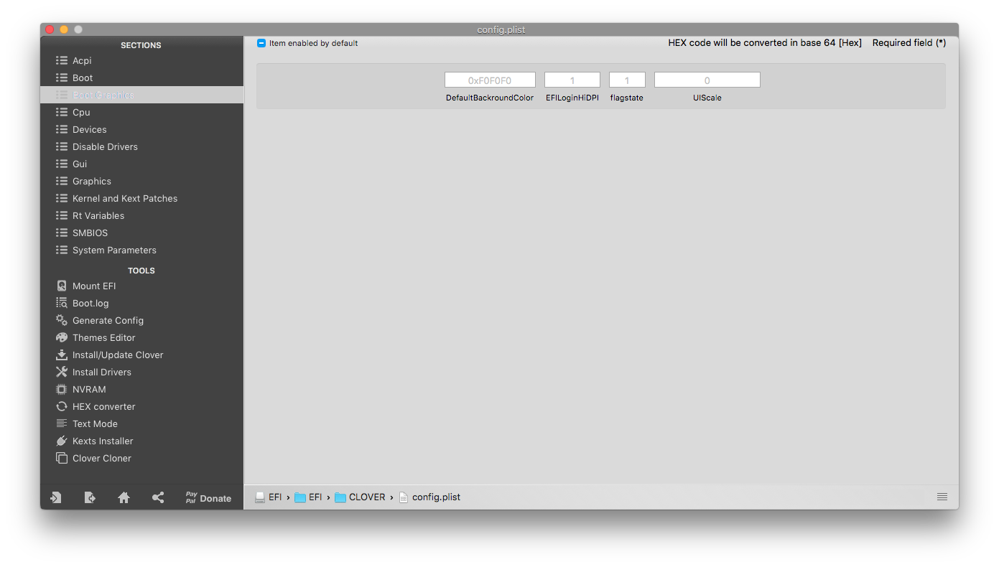
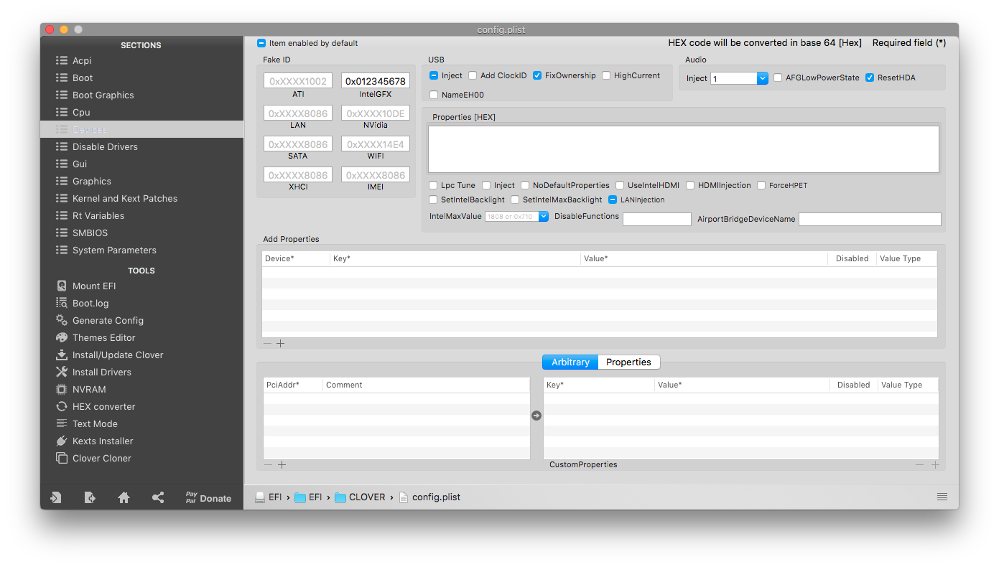
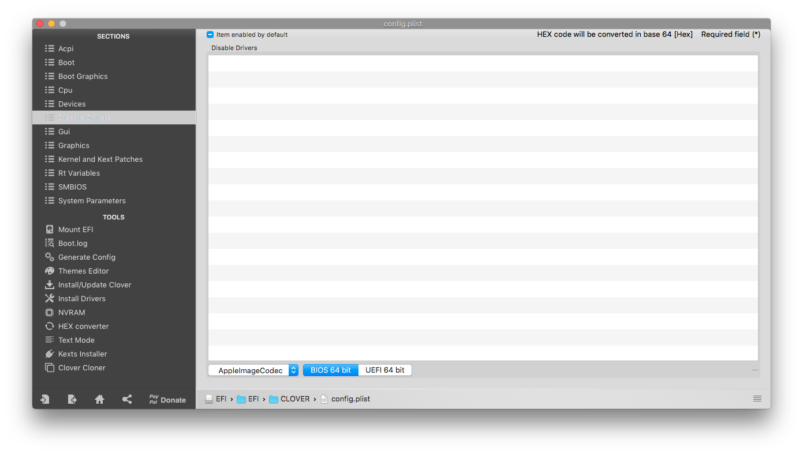
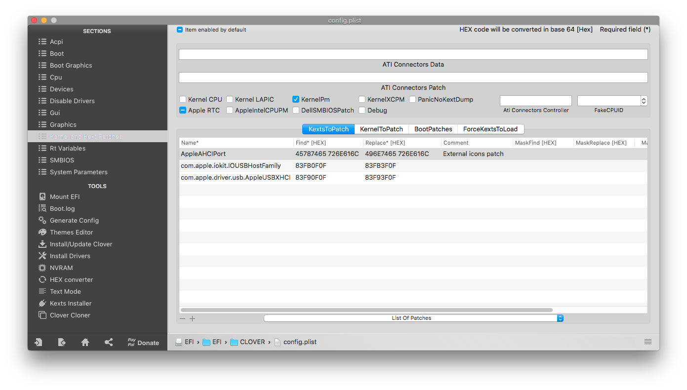
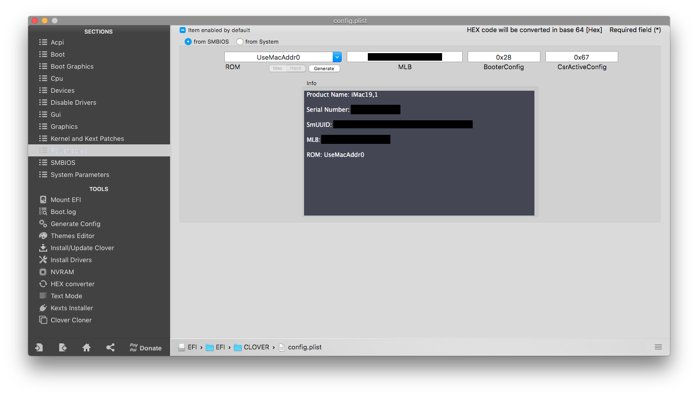
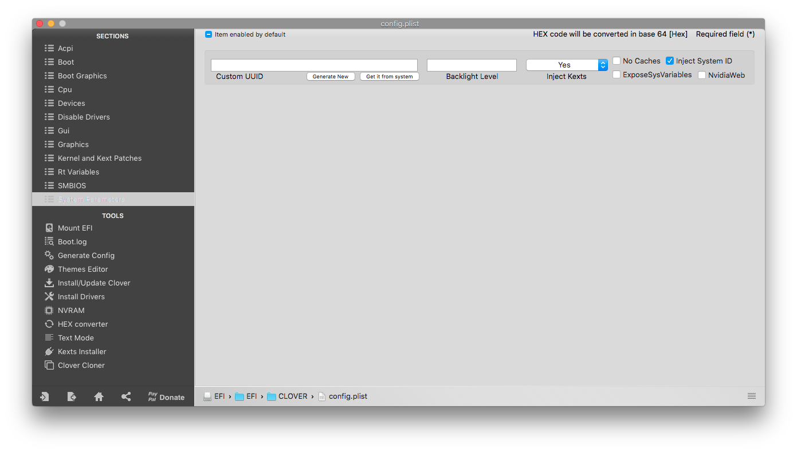
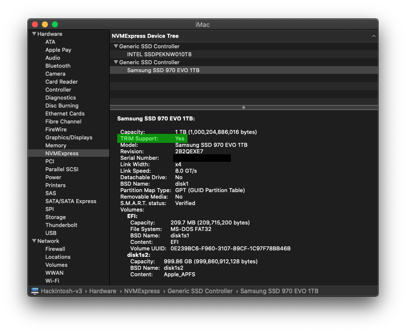

# Hackintosh v3
Installation guide for my Hackintosh v3 build dual-booting macOS Catalina and Windows 10.

* [`EFI_install`](EFI_install/): Copy of EFI directory from the EFI partition of USB installer
* `EFI`: Copy of EFI directory from the EFI partition of macOS boot drive

## Table of Contents

* [The Build](#the-build)
* [Prepare Install Media](#prepare-install-media)
* [Install Clover](#install-clover)
* [Gather Kexts](#gather-kexts)
* [Configure Clover](#configure-clover)
* [BIOS Settings](#bios-settings-version-f10)
* [Prepare for macOS Installation](#prepare-for-macos-installation)
* [Install macOS Catalina](#install-macos-catalina)
* [Post Installation](#post-installation)
  * [Make macOS Drive Bootable](#make-macos-drive-bootable)
  * [Map USB Ports](#map-usb-ports)
  * [Enable the Graphics Card](#enable-the-graphics-card)
  * [Enable TRIM for Solid State Drives](#enable-trim-for-solid-state-drives)
  * [Fix CPU Type in About This Mac](#fix-cpu-type-in-about-this-mac)
  * [Final Clover Configuration](#final-clover-configuration)
* [References](#references)

## The Build

* **CPU:** Intel Core i7-9700K
* **CPU Cooler:** Corsair H100i PRO (Connected to CPU_FAN and F_USB2)
* **Motherboard:** Gigabyte Z390 AORUS PRO WIFI
* **Memory:** Corsair Vengeance RGB Pro 16 GB DDR4-3600
* **Storage (macOS):** Samsung 970 Evo 1 TB M.2 NVME SSD (M2A Slot)
* **Storage (Windows):** Intel 660p Series 1 TB M.2 NVME SSD (M2M Slot)
* **Video Card:** Gigabyte Radeon RX 5700 XT 8 GB GAMING OC
* **Power Supply:** Corsair RM650 80+ Gold
* **Case:** NZXT H510
* **Monitor:** Dell S2719DGF 27" LED QHD FreeSync Monitor
* **Keyboard:** Das Keyboard Model S Professional
* **Mouse:** Logitech G603

View the build on PCPartPicker: https://pcpartpicker.com/list/kBK7TC

## Prepare Install Media

1. Download the [macOS Catalina installer](https://apps.apple.com/us/app/macos-catalina/id1466841314?mt=12) (v10.15.1) from the Mac App Store
2. Open Terminal and format the target USB drive as with the following command:

    `diskutil partitionDisk /dev/disk# GPT JHFS+ "USB" 100%`
    
3. [Create the bootable macOS installer](https://support.apple.com/sl-si/HT201372): 

    `sudo /Applications/Install\ macOS\ Catalina.app/Contents/Resources/createinstallmedia --volume /Volumes/USB`

4. Once the program finishes, your USB drive should now be called `Install macOS Catalina`

## Install Clover

* Download [Clover Install Package](https://github.com/Dids/clover-builder/releases) (v2.5k_r5097) and [Clover Configurator Global Edition](http://mackie100projects.altervista.org/download-clover-configurator/) (v5.7.0.0)
* Install Clover to the USB device and customize with the following options:
  * Clover for UEFI booting only
  * Install Clover in the ESP
  * UEFI Drivers
    * Recommended drivers
      * ApfsDriverLoader
      * HFSPlus
    * Memory fix drivers
      * OsxAptioFix3Drv
    * FileVault 2 UEFI Drivers
      * AppleImageCodec
      * AppleKeyAggregator
      * AppleKeyFeeder
      * AppleUITheme
      * FirmwareVolume
    * Additional drivers
      * EmuVariableUefi
 
## Gather Kexts

* [AppleALC.kext](https://github.com/acidanthera/AppleALC/releases) (v1.4.3)
* [IntelMausiEthernet.kext](https://onedrive.live.com/?authkey=%21APjCyRpzoAKp4xs&id=FE4038DA929BFB23%21455134&cid=FE4038DA929BFB23) (v2.5.0)
* [Lilu.kext](https://github.com/acidanthera/Lilu/releases) (v1.3.9)
* [USBInjectAll.kext](https://bitbucket.org/RehabMan/os-x-usb-inject-all/downloads/) (v0.7.1)
* [VirtualSMC.kext](https://github.com/acidanthera/VirtualSMC/releases) (v1.0.9)
  * SMCProcessor.kext
  * SMCSuperIO.kext
* [WhateverGreen.kext](https://github.com/acidanthera/WhateverGreen/releases) (v1.3.4)

1. Use Clover Configurator to mount the EFI partition of the USB drive
2. Copy the downloaded .kexts to `EFI/CLOVER/kexts/Other/` on the USB drive EFI partition
3. Copy `VirtualSmc.efi` to `EFI/CLOVER/drivers/UEFI/` on the USB drive EFI partition

The exact kexts and drivers I used during my installation can be found in [`EFI_install/`](EFI_install/).

## Configure Clover

The Clover configuration for the installation is heavily based upon corpnewt's [r/Hackintosh Vanilla Desktop Guide](https://hackintosh.gitbook.io/-r-hackintosh-vanilla-desktop-guide/) for the [Coffee Lake](https://hackintosh.gitbook.io/-r-hackintosh-vanilla-desktop-guide/config.plist-per-hardware/coffee-lake) microarchitecture. The major difference is with how the iGPU is enabled because I encountered difficulties when using device property injections. Each section of the configuration in Clover Configurator is documented below. A sanitized version of the config file I used can be found in [`EFI_install/CLOVER/`](EFI_install/CLOVER/). You will need to use Clover Configurator or [`macserial`](https://github.com/acidanthera/MacInfoPkg/releases) to generate a valid serial number and board serial number for the `iMac19,1`  SMBIOS.

* ACPI
  
  
* Boot
  
* Boot Graphics
  
* CPU
  
* Devices
  
  
* Disable Drivers
  
* GUI
  
* Graphics
  
* Kernel and Kext Patches
  
* Rt Varibles
  
* SMBIOS
  
* System Parameters
  


## BIOS Settings (Version F10)

* Save & Exit
  * **Load Optimized Defaults**
* M.I.T.
  * Advanced Frequency Settings
    * Extreme Memory Profile (X.M.P.) → **Profile 1**
  * Smart Fan 5 Settings
    * CPU_FAN (or whichever header was used for the AIO CPU cooler)
      * Speed Control → **Full Speed**
      * Control Mode → **Voltage**
* BIOS
  * Windows 8/10 Features → **Windows 8/10**
  * CSM Support → **Disabled**
* Peripherals
  * Initial Display Output → **IGFX**
  * Intel Platform Trust Technology (PTT) → **Disabled**
  * USB Configuration
    * Legacy USB Support → **Enabled**
    * XHCI Hand-off → **Enabled**
  * Network Stack Configuration
    * Network Stack → **Disabled**
* Chipset
  * Vt-d → **Disabled**
  * Internal Graphics → **Enabled**
  * DVMT Pre-Alloc → **32M**
  * DVMT Total Gfx Mem → **256M**
  * Audio Controller → **Enabled**
  * Above 4G Decoding → **Enabled**
* Power
  * ErP → **Disabled**
  * RC6 (Render Standby) → **Enabled**
* Save & Exit
  * Choose **Save and Exit** to save BIOS settings and reboot

## Prepare for macOS Installation

1. Connect HDMI cable to the integrated graphics output on the motherboard
2. Insert macOS Installer USB drive into the USB 3.0 port adjacent to Ethernet connector
3. Connect keyboard and mouse to USB 2.0 ports


## Install macOS Catalina

1. Restart computer and select the USB drive as the default BIOS boot device 
2. Select `Install macOS Catalina` as the Clover boot volume 
3. Launch Disk Utility and format the destination drive (Samsung 970 Evo)
    * Name: `Macintosh SSD`
    * Format: `Mac OS Extended (Journaled)` or `APFS` (will be reformatted as `APFS` during installation)
    * Scheme: `GUID Partition Map`
2. Launch Install macOS and select the `Macintosh SSD` drive as the destination 
    * As the system restarts, keep selecting `Boot macOS Install from Macintosh SSD` from the Clover menu
    * If the system freezes, use the power button to shut down the computer and turn off the power supply. Wait a few minutes before restarting to continue the installation process.
4. Once the installation is complete, select `Boot macOS from Macintosh SSD` from the Clover menu
    * Proceed through the normal macOS setup but delay signing into iCloud until post installation is complete
    
## Post Installation

### Make macOS Drive Bootable

1. Mount the EFI partition of `Macintosh SSD` and copy over the entire EFI directory from the USB drive
2. Restart the computer and select the internal drive (Samsung 970 Evo) as the default BIOS boot device
3. Select `Boot macOS from Macintosh SSD` from the Clover menu
4. You should now have a bootable macOS installation!

_Note: You can now remove the USB drive but keep it handy for debugging issues with your Hackintosh._

### Map USB Ports

Apple's USB driver implementation restricts macOS to only 15 HS/SS ports. During the installation process, we utilized RehabMan's [USBInjectAll](https://github.com/RehabMan/OS-X-USB-Inject-All) kext and USB port limit kext patches to `com.apple.iokit.IOUSBHostFamily` and `com.apple.driver.usb.AppleUSBXHCI` to circumvent this restriction. While useful during installation, it is generally recommended that these workarounds be removed in favor of a custom SSDT or port injector kext for the final system configuration to avoid buffer overruns and sleep/wake issues. In order to map out the custom port injection for system, we will be using corpnewt's [USBMap](https://github.com/corpnewt/USBMap) Python script and following along with the process described in [Carl Mercier's YouTube video](https://www.youtube.com/watch?v=j3V7szXZZTc).

_If you have the Gigabyte Z390 AORUS PRO WIFI motherboard and want the same USB port mapping I utilize, you can download my [`USBMap.kext`](EFI/CLOVER/kexts/Other/USBMap.kext), [`SSDT-USBX.aml`](EFI/CLOVER/ACPI/patched/SSDT-USBX.aml), and [`SSDT-USBX.dsl`](EFI/CLOVER/ACPI/patched/SSDT-USBX.dsl) and skip to Step 5._

1. Add the following two patches to the ACPI Clover configuration on the EFI partition of `Macintosh SSD` and reboot

    
    
2. Open Terminal and run the following commands to download and execute the USBMap script:
    ```
    git clone https://github.com/corpnewt/USBMap
    cd USBMap
    chmod +x USBMap.command
    ./USBMap.command
    ```
3. Press `d` then `[enter]` to begin the port discovery process. Using a USB device (e.g. flash drive), systematically test each external USB port to identify its corresponding ID. The complete USB port layout for the Gigabyte Z390 AORUS PRO WIFI motherboard is detailed in the image below. Once the desired ports have been identified, press `q` then `[enter]` to return to the main menu. 

    

4. Press `p` then `[enter]` to begin creating the custom port mapping kext
    1. Press `a` then `[enter]` to enable all ports
    2. Using the list of identified ports, enter the numbers of the ports you want to **disable**
        * No more than 15 XHC ports can be enabled
        * `2,3,4,9,11,12,14,15,16,18,25` → `HS02,HS03,HS04,HS09,HS11,HS12,HS14,USR1,USR2,SS02,SS09`
          * Disables onboard Bluetooth, AIO control, and USB 2.0 support for the two ports immediately beneath the HDMI port
        * The enabled ports are red and the disabled ports are gray in the image above
    3. Press `k` then `[enter]` to build the custom USBMap.kext file
    4. Allow the program to move the files to your EFI partition or copy them manually:
        * `USBMap.kext` → [`EFI/CLOVER/kexts/Other/`](EFI/CLOVER/kexts/Other/)
        * `SSDT-USBX.aml` → [`EFI/CLOVER/ACPI/patched/`](EFI/CLOVER/ACPI/patched/)
        * `SSDT-USBX.dsl` → [`EFI/CLOVER/ACPI/patched/`](EFI/CLOVER/ACPI/patched/)
        
5. Modify the Clover configuration on the EFI partition of `Macintosh SSD`
    * ACPI
      * Remove the `change EHC2 to EH02` patch (not present on this system)
    * Kernel and Kext Patches
      * Remove the `com.apple.iokit.IOUSBHostFamily` kext patch
      * Remove the `com.apple.driver.usb.AppleUSBXHCI` kext patch
6. Delete the `USBInjectAll.kext` from `EFI/CLOVER/kexts/Other/` on the EFI partition of `Macintosh SSD`
7. You should now have fully custom-mapped USB ports on your system! Use the USBMap script after a reboot to verify the correct ports are enabled.


### Enable the Graphics Card

1. Modify the Clover configuration on the EFI partition of `Macintosh SSD`
    * Boot
      * Remove the `-wegnoegpu` boot argument
      * Add the `agdpmod=pikera` boot argument
    * Devices
      * Clear value of `IntelGFX` field
    * Graphics
      * Uncheck `Inject Intel`
2. Reboot the computer and modify the BIOS Settings
    * Peripherals
      * Initial Display Output → **PCIe Slot 1**
    * Chipset
      * Internal Graphics → **Disabled**
3. Save the changes and reboot the computer
4. Disconnect the HDMI cable from the motherboard and connect a DisplayPort cable to the graphics card
5. You should now be using the natively-supported discrete graphics card (as of macOS 10.15.1) 

_Note: You should also make these changes to your USB drive Clover configuration so that it can properly boot your system if the `Macintosh SSD` EFI partition gets messed up. If you don't update the configuration, you'll have to swap back to using the integrated graphics instead of the discrete graphics card._

### Enable TRIM for Solid State Drives

1. Open Terminal and enter the following command:

    `sudo trimforce enable`
    
2. Verify TRIM was enabled in System Report:

    

### Fix CPU Type in About This Mac

For some reason, About This Mac and System Report do not properly identify the processor and list it as an 'Intel Core i9' instead of an 'Intel Core i7.' This can easily be fixed by using Clover Configurator to set the CPU Type to `0x0705` and rebooting.


### Final Clover Configuration

A sanitized version of my final config file can be found in [`EFI/CLOVER/`](EFI/CLOVER/). Each section of the configuration in Clover Configurator is also documented below.


## References

* [u/corpnewt's r/Hackintosh Vanilla Desktop Guide](https://hackintosh.gitbook.io/-r-hackintosh-vanilla-desktop-guide/)
* [An iDiot's Guide To Lilu and its Plug-ins](https://www.tonymacx86.com/threads/an-idiots-guide-to-lilu-and-its-plug-ins.260063/)
* [[Guide] Intel Framebuffer patching using WhateverGreen](https://www.tonymacx86.com/threads/guide-intel-framebuffer-patching-using-whatevergreen.256490/)
* [Glasgood's macOS Mojave [SUCCESS][GUIDE] for Aorus Z390 Pro](https://www.insanelymac.com/forum/topic/337837-glasgoods-macos-mojave-successguide-for-aorus-z390-pro/)
* [[SUCCESS] Gigabyte Designare Z390 (Thunderbolt 3) + i7-9700K + AMD RX 580](https://www.tonymacx86.com/threads/success-gigabyte-designare-z390-thunderbolt-3-i7-9700k-amd-rx-580.267551/)
* [General Z390 Catalina Guide, or why you should take the time to set things from scratch (bonus 5700 XT guide)](https://www.reddit.com/r/hackintosh/comments/dpu4by/general_z390_catalina_guide_or_why_you_should/)
* [How to fix USB 3 ports on a Hackintosh by generating your own SSDT or USBMap.kext](https://www.youtube.com/watch?v=j3V7szXZZTc)

## Resources

* [Clover Configurator Global Edition](http://mackie100projects.altervista.org/download-clover-configurator/)
* [Clover Theme Manager](https://www.insanelymac.com/forum/topic/302674-clover-theme-manager/)
* [Hackintool](https://www.insanelymac.com/forum/topic/335018-hackintool-v286/)
* [MacInfoPkg (macserial)](https://github.com/acidanthera/MacInfoPkg)
* [USBMap](https://github.com/corpnewt/USBMap)
