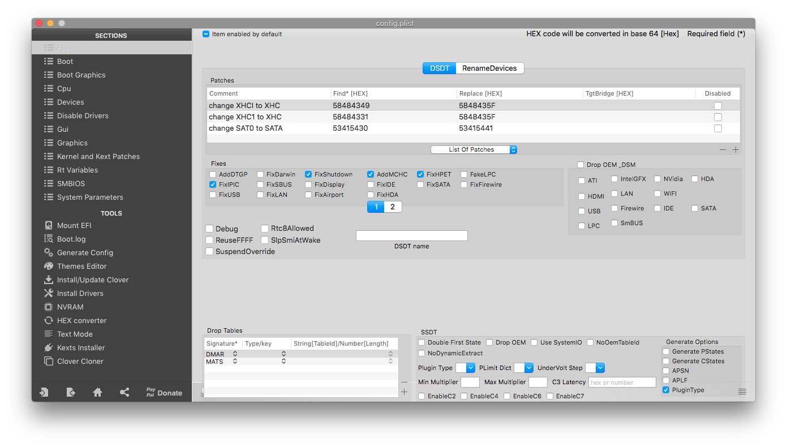
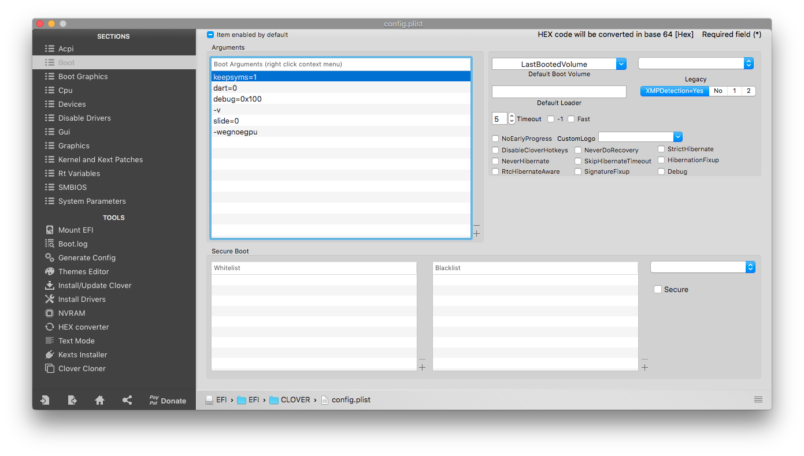
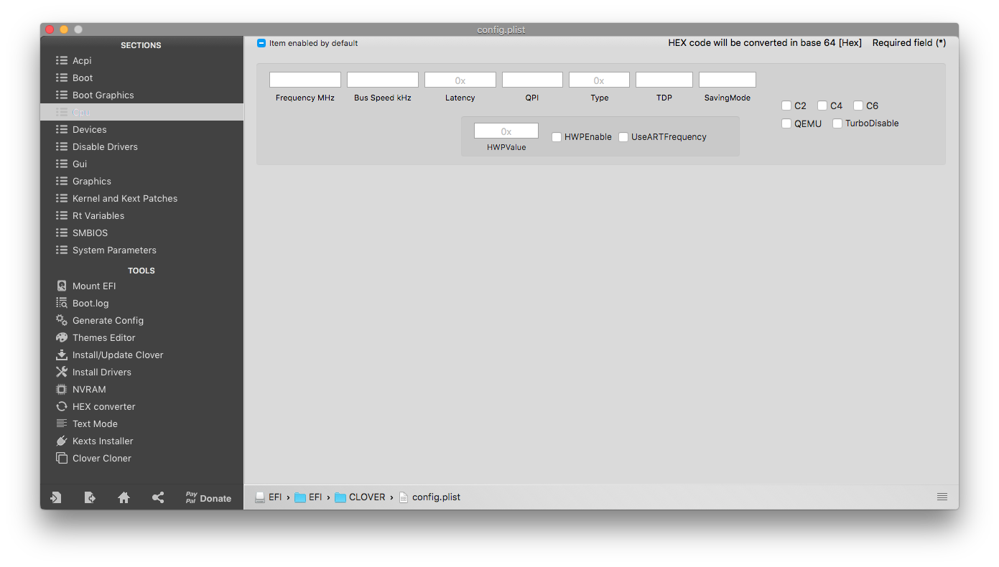
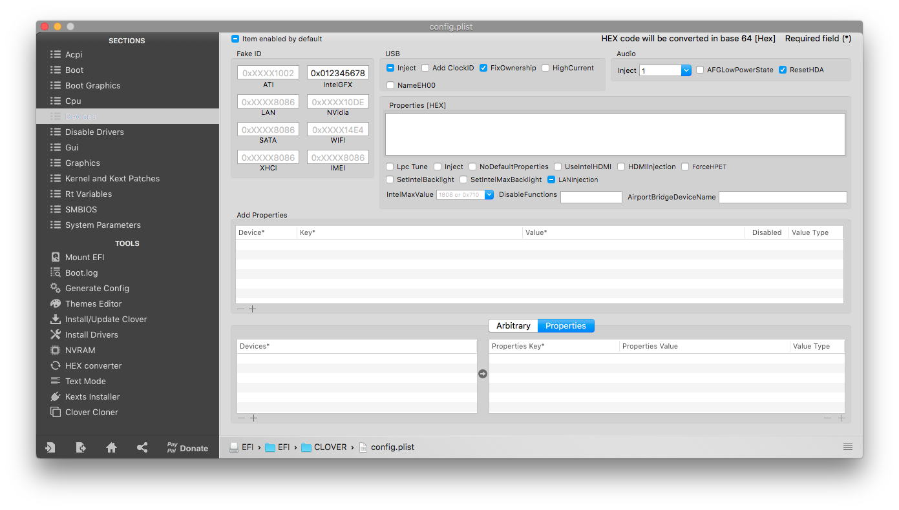
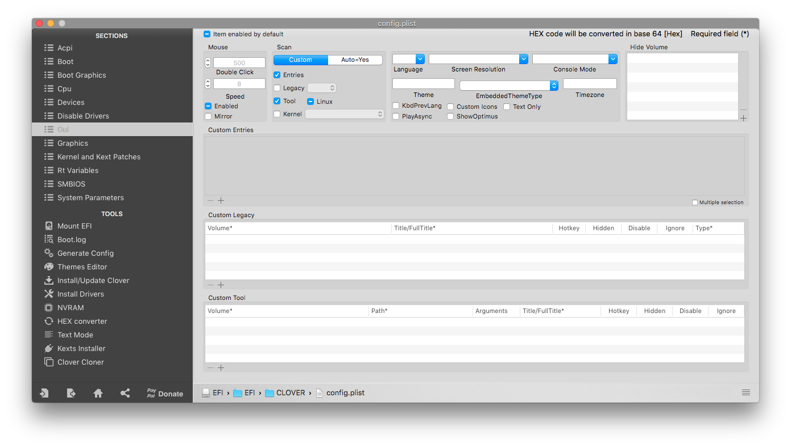
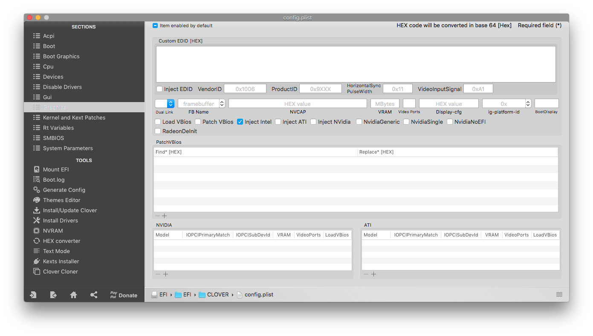
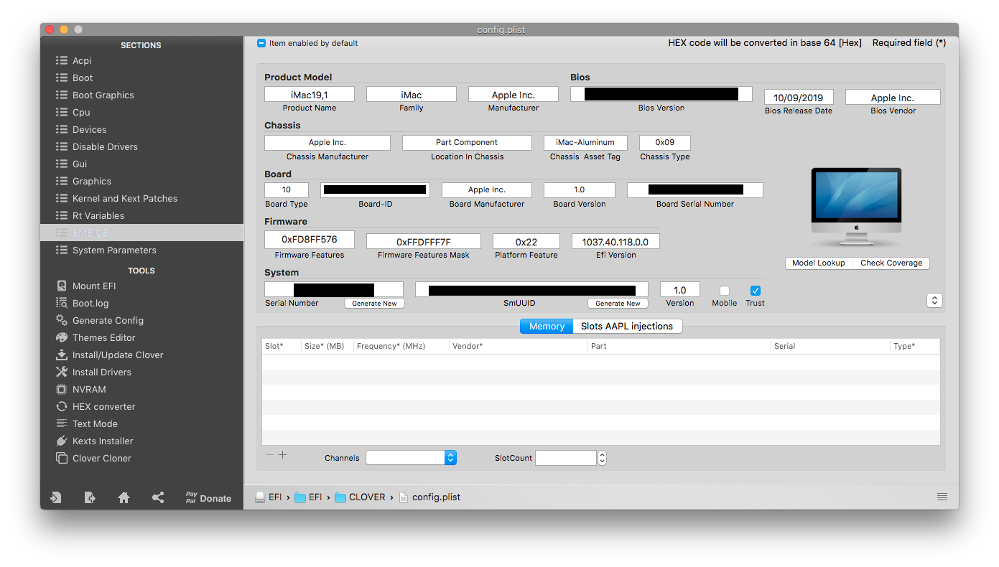
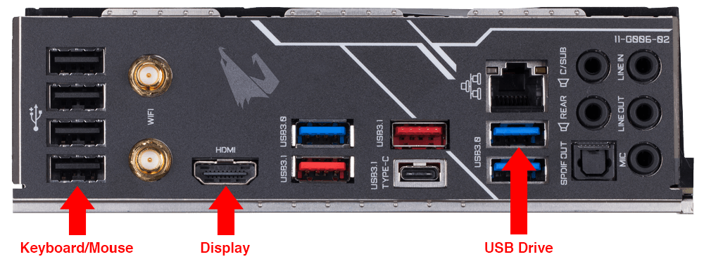

# Hackintosh v3
Installation guide for my Hackintosh v3 build dual-booting macOS Catalina and Windows 10.

* [`EFI_install`](EFI_install/): Copy of EFI directory from the EFI partition of USB installer
* `EFI`: Copy of EFI directory from the EFI partition of macOS boot drive

## Table of Contents

* [The Build](#the-build)
* [Prepare Install Media](#prepare-install-media)
* [Install Clover](#install-clover)
* [Gather Kexts](#gather-kexts)
* [Configure Clover](#configure-clover)
* [BIOS Settings](#bios-settings-version-f10)
* [Prepare for macOS Installation](#prepare-for-macos-installation)
* [Install macOS Catalina](#install-macos-catalina)
* [Post Installation](#post-installation)
  * [Make macOS Drive Bootable](#make-macos-drive-bootable)
* [References](#references)

## The Build

* **CPU:** Intel Core i7-9700K
* **CPU Cooler:** Corsair H100i PRO
* **Motherboard:** Gigabyte Z390 AORUS PRO WIFI
* **Memory:** Corsair Vengeance RGB Pro 16 GB DDR4-3600
* **Storage (macOS):** Samsung 970 Evo 1 TB M.2 NVME SSD
* **Storage (Windows):** Intel 660p Series 1 TB M.2 NVME SSD
* **Video Card:** Gigabyte Radeon RX 5700 XT 8 GB GAMING OC
* **Power Supply:** Corsair RM650 80+ Gold
* **Case:** NZXT H510
* **Monitor:** Dell S2719DGF 27" LED QHD FreeSync Monitor
* **Keyboard:** Das Keyboard Model S Professional
* **Mouse:** Logitech G603

View the build on PCPartPicker: https://pcpartpicker.com/list/kBK7TC

## Prepare Install Media

1. Download the [macOS Catalina installer](https://apps.apple.com/us/app/macos-catalina/id1466841314?mt=12) (v10.15.1) from the Mac App Store
2. Open Terminal and format the target USB drive as with the following command:

    `diskutil partitionDisk /dev/disk# GPT JHFS+ "USB" 100%`
    
3. [Create the bootable macOS installer](https://support.apple.com/sl-si/HT201372): 

    `sudo /Applications/Install\ macOS\ Catalina.app/Contents/Resources/createinstallmedia --volume /Volumes/USB`

4. Once the program finishes, your USB drive should now be called `Install macOS Catalina`

## Install Clover

* Download [Clover Install Package](https://github.com/Dids/clover-builder/releases) (v2.5k_r5097) and [Clover Configurator Global Edition](http://mackie100projects.altervista.org/download-clover-configurator/) (v5.7.0.0)
* Install Clover to the USB device and customize with the following options:
  * Clover for UEFI booting only
  * Install Clover in the ESP
  * UEFI Drivers
    * Recommended drivers
      * ApfsDriverLoader
      * HFSPlus
    * Memory fix drivers
      * OsxAptioFix3Drv
    * FileVault 2 UEFI Drivers
      * AppleImageCodec
      * AppleKeyAggregator
      * AppleKeyFeeder
      * AppleUITheme
      * FirmwareVolume
    * Additional drivers
      * EmuVariableUefi
 
## Gather Kexts

* [AppleALC.kext](https://github.com/acidanthera/AppleALC/releases) (v1.4.3)
* [IntelMausiEthernet.kext](https://onedrive.live.com/?authkey=%21APjCyRpzoAKp4xs&id=FE4038DA929BFB23%21455134&cid=FE4038DA929BFB23) (v2.5.0)
* [Lilu.kext](https://github.com/acidanthera/Lilu/releases) (v1.3.9)
* [USBInjectAll.kext](https://bitbucket.org/RehabMan/os-x-usb-inject-all/downloads/) (v0.7.1)
* [VirtualSMC.kext](https://github.com/acidanthera/VirtualSMC/releases) (v1.0.9)
  * SMCProcessor.kext
  * SMCSuperIO.kext
* [WhateverGreen.kext](https://github.com/acidanthera/WhateverGreen/releases) (v1.3.4)

1. Use Clover Configurator to mount the EFI partition of the USB drive
2. Copy the downloaded .kexts to `EFI/CLOVER/kexts/Other/` on the USB drive EFI partition
3. Copy `VirtualSmc.efi` to `EFI/CLOVER/drivers/UEFI/` on the USB drive EFI partition

The exact kexts and drivers I used during my installation can be found in [`EFI_install/`](EFI_install/).

## Configure Clover

The Clover configuration for the installation is heavily based upon u/corpnewt's [r/Hackintosh Vanilla Desktop Guide](https://hackintosh.gitbook.io/-r-hackintosh-vanilla-desktop-guide/) for the [Coffee Lake](https://hackintosh.gitbook.io/-r-hackintosh-vanilla-desktop-guide/config.plist-per-hardware/coffee-lake) microarchitecture. Each section of the configuration in Clover Configurator is documented below. A sanitized version of the config file I used can be found in [`EFI_install/CLOVER/`](EFI_install/CLOVER/). You will need to use Clover Configurator or [`macserial`](https://github.com/acidanthera/MacInfoPkg/releases) to generate a valid serial number and board serial number for the `iMac19,1`  SMBIOS.

* ACPI
  
  
* Boot
  
* Boot Graphics
  
* CPU
  
* Devices
  
  
* Disable Drivers
  
* GUI
  
* Graphics
  
* Kernel and Kext Patches
  
* Rt Varibles
  
* SMBIOS
  
* System Parameters
  

## BIOS Settings (Version F10)

* Save & Exit
  * **Load Optimized Defaults**
* M.I.T.
  * Advanced Frequency Settings
    * Extreme Memory Profile (X.M.P.) → **Profile 1**
  * Smart Fan 5 Settings
    * CPU_FAN (or whichever header was used for the AIO)
      * Speed Control → **Full Speed**
      * Control Mode → **Voltage**
* BIOS
  * Windows 8/10 Features → **Windows 8/10**
  * CSM Support → **Disabled**
* Peripherals
  * Initial Display Output → **IGFX**
  * Intel Platform Trust Technology (PTT) → **Disabled**
  * USB Configuration
    * Legacy USB Support → **Enabled**
    * XHCI Hand-off → **Enabled**
  * Network Stack Configuration
    * Network Stack → **Disabled**
* Chipset
  * Vt-d → **Disabled**
  * Internal Graphics → **Enabled**
  * DVMT Pre-Alloc → **64M**
  * DVMT Total Gfx Mem → **256M**
  * Audio Controller → **Enabled**
  * Above 4G Decoding → **Enabled**
* Power
  * ErP → **Disabled**
  * RC6 (Render Standby) → **Enabled**
* Save & Exit
  * Choose **Save and Exit** to save BIOS settings and reboot

## Prepare for macOS Installation

1. Connect HDMI cable to the integrated graphics output on the motherboard
2. Insert macOS Installer USB drive into the USB 3.0 port adjacent to Ethernet connector
3. Connect keyboard and mouse to USB 2.0 ports

## Install macOS Catalina

1. Restart computer and select the USB drive as the default BIOS boot device 
2. Select `Install macOS Catalina` as the Clover boot volume 
3. Launch Disk Utility and format the destination drive (Samsung 970 Evo)
    * Name: `Macintosh SSD`
    * Format: `Mac OS Extended (Journaled)` or `APFS` (will be reformatted as `APFS` during installation)
    * Scheme: `GUID Partition Map`
2. Launch Install macOS and select the `Macintosh SSD` drive as the destination 
    * As the system restarts, keep selecting `Boot macOS Install from Macintosh SSD` from the Clover menu
    * If the system freezes, use the power button to shut down the computer and turn off the power supply. Wait a few minutes before restarting to continue the installation process.
4. Once the installation is complete, select `Boot macOS from Macintosh SSD` from the Clover menu
    * Proceed through the normal macOS setup but do not sign into iCloud
    
## Post Installation

### Make macOS Drive Bootable

1. Mount the EFI partition of `Macintosh SSD` and copy over the entire EFI directory from the USB drive
2. Restart the computer and select the internal drive (Samsung 970 Evo) as the default BIOS boot device
3. Select `Boot macOS from Macintosh SSD` from the Clover menu
4. You should now have a bootable macOS installation!

## References

* [u/corpnewt's r/Hackintosh Vanilla Desktop Guide](https://hackintosh.gitbook.io/-r-hackintosh-vanilla-desktop-guide/)
* [Glasgood's macOS Mojave [SUCCESS][GUIDE] for Aorus Z390 Pro](https://www.insanelymac.com/forum/topic/337837-glasgoods-macos-mojave-successguide-for-aorus-z390-pro/)
* [[SUCCESS] Gigabyte Designare Z390 (Thunderbolt 3) + i7-9700K + AMD RX 580](https://www.tonymacx86.com/threads/success-gigabyte-designare-z390-thunderbolt-3-i7-9700k-amd-rx-580.267551/)

https://www.reddit.com/r/hackintosh/comments/djh98y/hackintosh_gigabyte_z390_pro_i99900k_rx_590/
https://www.reddit.com/r/hackintosh/comments/bb3hy5/build_i9_9900k_gigabyte_z390_aorus_pro_wifi/
https://www.reddit.com/r/hackintosh/comments/dpu4by/general_z390_catalina_guide_or_why_you_should/
https://www.tonymacx86.com/threads/an-idiots-guide-to-lilu-and-its-plug-ins.260063/
https://www.tonymacx86.com/threads/guide-intel-framebuffer-patching-using-whatevergreen.256490/
